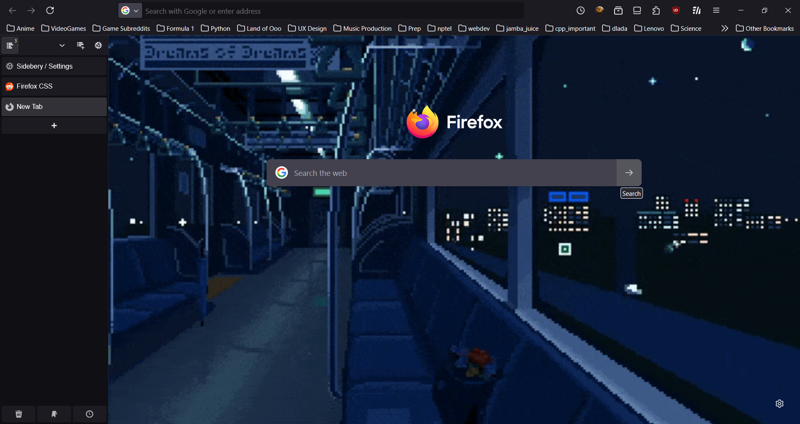

# Firefox + Sidebery Setup

---
## Pre-requisites

- Make sure to turn on Vertical Tabs and disable menu bar.

## Apply UserChrome.css

- Type `about:support` in the url bar and open up your profile folder.

- Copy the `chrome` folder in the profile folder.

- Back in firefox url bar, type `about:config` and toggle `toolkit.legacyUserProfileCustomizations.stylesheets` to **true**.

## Sidebery Configuration

- Open Sidebery settings and scroll down until you see `Styles editor`.

- Copy the css code in the `sidebery.css` into the `Styles editor` code pane.

Great!. It's my first firefox setup. I will accept that it's a bit on the minimalistic side but I will try to add on more code in the future as long as I can keep the memory consumption at minimum.
